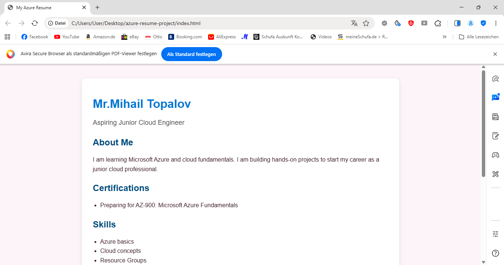
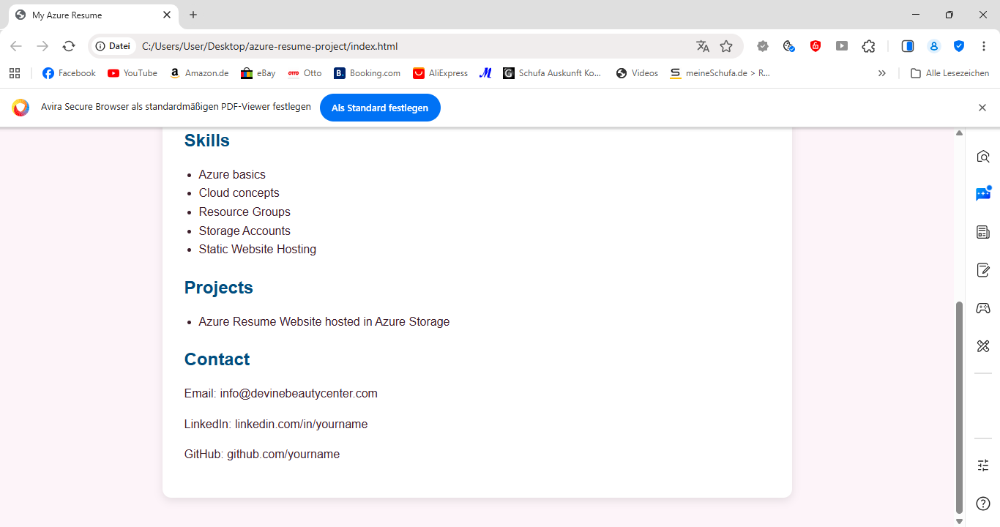
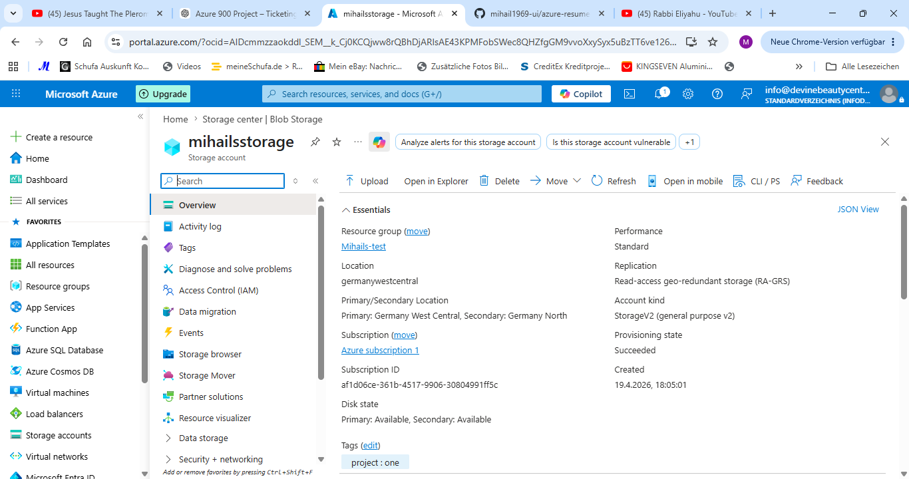

# Azure Resume Website

## Project Overview

This project is a personal resume website hosted on Microsoft Azure using Azure Storage Static Website Hosting.

It was built as a hands-on cloud fundamentals project while preparing for the AZ-900 Microsoft Azure Fundamentals certification.

The goal of this project was to gain practical experience with Azure resource deployment, storage services, and static web hosting.

---

## Azure Services Used

* Azure Resource Group
* Azure Storage Account
* Azure Blob Storage
* Azure Static Website Hosting

---

## Features

* Responsive personal resume website
* Hosted entirely in Microsoft Azure
* Publicly accessible via Azure web endpoint
* Cloud-based deployment without traditional web servers

---

## Skills Demonstrated

* Creating and managing Azure Resource Groups
* Deploying Azure Storage Accounts
* Configuring Static Website Hosting
* Uploading and managing Blob Storage content
* Publishing a live cloud-hosted website
* Basic HTML and CSS web development

---

## Project Architecture

User Browser
↓
Azure Static Website Endpoint
↓
Azure Storage Account
↓
Blob Storage ($web container)

---

## What I Learned

Through this project I learned how to:

* Organize Azure resources using Resource Groups
* Host static websites in Azure Storage
* Configure Azure Storage for web hosting
* Deploy files to Azure Blob Storage
* Understand how cloud-hosted websites are delivered to users

---

## Live Project

Add your Azure website URL here:

https://mihailsstorage.z1.web.core.windows.net/

---

## Future Improvements

* Add custom domain name
* Implement visitor counter with Azure Functions
* Connect backend database for dynamic content
* Improve UI/UX design

---

## Author

Mihail Topalov
Aspiring Junior Cloud Engineer
AZ-900 Student / Candidate
## Screenshots

### Resume Homepage

### Resume Additional Sections

### Azure Storage Account Overview

---

## Deployment Note

This project was deployed and tested using Microsoft Azure Static Website Hosting.  
The live Azure endpoint may be inactive due to subscription limitations, but the full source code, screenshots, and deployment architecture are included in this repository.